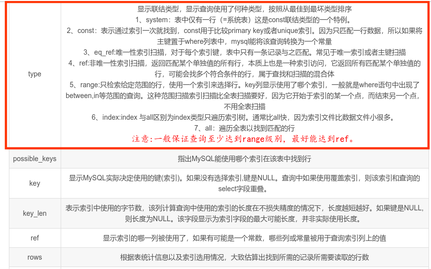

mysql 

#### 查看sql语句运行时间

- set profiling=1; # 开启profiling
- 使用SQL语句后 使用show profiles; show profile for query number;
- 
- name是唯一索引 和 id是主键

#### 如何定位并优化慢查询 SQL

- 根据满日志定位慢查询 sql
  - show variables like '%quer%';
  - 
  - show status like '%slow_queries%';  # 本次会话的慢查询sql数量
  - 
  - set global slow_query_log = on;  打开慢查询日志
  - set global long_query_time = 1;# 设置慢日志查询时间
  - 
- 使用 explain 等工具分析sql
  - explain 用来分析 mysql 如何执行查询操作，以及 mysql 成功返回结果集需要执行的行数
  - explain 放在 select 前面
  - explain SELECT name FROM person_info_large order by name desc;
  - 
  - 主要注意 type 和 extra 字段。
  - 
  - 
  - 
  - mysql 语句执行顺序
  - 
- 修改 sql 或者尽量让 sql 走索引
  - 
  - 或给name字段加上索引 : alter table person_info_large add index inx_name(name);
  - 

#### 最左匹配原则

- 

#### 索引是建立得越多越好吗

- 数据量小的表不需要建立索引，建立会增加额外的开销
- 数据变更需要维护索引，因此更多的索引意味着更多的维护成本
- 更多的索引意味着需要更多的空间

#### MyISAM 与 InnoDB 关于锁方面的区别

- MyISAM 默认用的是表级锁，不支持行级锁
- InnoDB 默认用的是行级锁，也支持表级锁

##### MyISAM 锁

- 显式给表加上读锁 lock tables person_info_myisam read; unlock tables;

- 加写锁 lock tables person_info_myisam write;
- 写锁即排它锁 读锁即共享锁
- 对select加上排它锁 select * from person_info_myisam where id between 1 and 2000000 for update;

##### InnoDB 锁

- 默认开启自动提交
- set autocommit = 0; # 关闭自动提交
- 如果不关闭自动提交，也可使用事务
- InnoDB 加共享锁 select ... lock in share mode;
- 查询语句不使用索引时，会使用表级锁；使用索引时，行级锁和 gap 锁(间隙锁)
- 意向锁 IS 和 IX 相当于表锁，做表级别的操作时，不用去轮询每一行是否有行级锁

##### MyISAM 适用场景

- 频繁执行全表 count 语句 (MyISAM 使用一个变量来保存表中有多少条数据，查询时直接查询该变量)
- 对数据进行增删改的频率不高，查询非常频繁
- 没有事务

##### InnoDB 适用场景

- 数据增删改查都相当频繁
- 可靠性要求比较高，要求支持事务

#### 事务隔离

- InnoDB 默认为 'REPEATABLE-READ' (可重复读)

- select @@tx_isolation;# 查询事务隔离级别，但此变量在mysql8.0后被更改为 transaction_isolation;
- select @@transaction_isolation; # mysql8
- set session transaction isolation level read uncommitted;# 更改事务隔离级别为未提交读
- set session transaction isolation level read committed;# 提交读
- 
- start transaction;
  update ... set ... where ..;
  rollback;# commit;
- 
- 快照读 又称 非阻塞读
- 

#### InnoDB 可重复读隔离级别下如何避免幻读

- next-key锁 (行锁 + gap 锁)
- 
- 