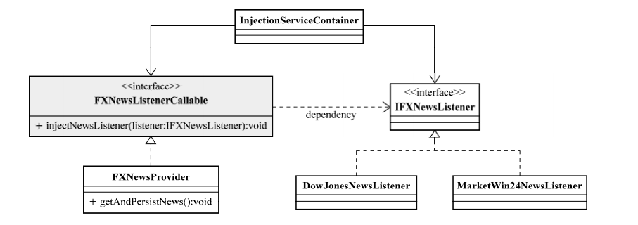
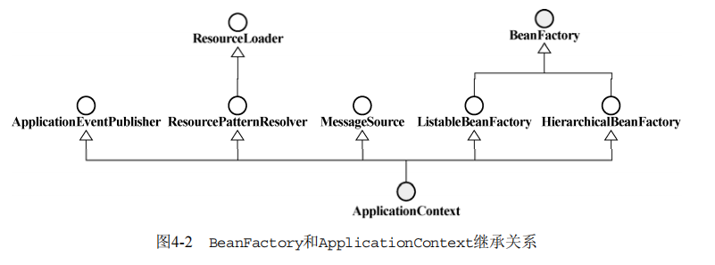

## SpringIOC

#### 对 IOC 的理解
- IOC 出现之前，使用者需要主动去 new 一个对象，代码如下：

```java
// 用户需要获取指定媒体的新闻，此处使用重耦合方式。
// 如果用户改变主意，需要获取另一家媒体的新闻，开发者需要修改所有调用该类的地方。
public class FXNewsProvider {
    private IFXNewsListener newsListener = new NewsListener(); ;
    private IFXNewsPersister newPersistener = new NewsPersistener(); 
}
```

IOC出现之后，原来是需要什么东西自己去拿，现在是需要什么东西就让别人送过来。使用者不需要主动获取依赖对象，避免了类之间的直接耦合。IoC是一种可以帮助我们解耦各业务对象间依赖关系的对象绑定方式!

通常情况下，被注入对象会直接依赖于被依赖对象。但是，在IoC的场景中，二者之间通过IoC Service Provider来打交道，所有的被注入对象和依赖对象现在由IoC Service Provider统一管理。被注入对象需要什么，直接跟IoC Service Provider招呼一声，后者就会把相应的被依赖对象注入到被注入对象中，从而达到IoC Service Provider为被注入对象服务的目的。IoC Service Provider在这里就是通常的IoC容器所充当的角色。从被注入对象的角度看，与之前直接寻求依赖对象相比，依赖对象的取得方式发生了反转，控制也从被注入对象转到了IoC Service Provider那里

#### IOC的依赖注入方式

- 构造方法注入

  ```java
  // 类比: 构造方法注入方式比较直观，对象被构造完成后，即进入就绪状态，可以马上使用。这就好比你刚进酒吧的门，服务生已经将你喜欢的啤酒摆上了桌面一样。坐下就可马上享受一份清凉与惬意。
  public FXNewsProvider(IFXNewsListener newsListner, IFXNewsPersister newsPersister) {
          this.newsListener = newsListner;
          this.newPersistener = newsPersister;
  }
  FXNewsProvider dowJonesNewsProvider = new FXNewsProvider(new DowJonesNewsListener(),new DowJonesNewsPersister());  
  FXNewsPrivider marketWin24NewsProvider = new FXNewsProvider(new MarketWin24NewsListener(),new DowJonesNewsPersister());
  ```

  

- setter方法注入

  ```java
  // 外界可以通过调用setNewsListener和setNewPersistener方法为FXNewsProvider对象注入所依赖的对象了
  // setter方法注入虽不像构造方法注入那样，让对象构造完成后即可使用，但相对来说更宽松一些，可以在对象构造完成后再注入。这就好比你可以到酒吧坐下后再决定要点什么啤酒，可以要百威，也可以要青岛，随意性比较强。如果你不急着喝，这种方式当然是最适合你的
  public class FXNewsProvider {
      private IFXNewsListener newsListener;
      private IFXNewsPersister newPersistener;
  
      public IFXNewsListener getNewsListener() {
          return newsListener;
      }
  
      public void setNewsListener(IFXNewsListener newsListener) {
          this.newsListener = newsListener;
      }
  
      public IFXNewsPersister getNewPersistener() {
          return newPersistener;
      }
  
      public void setNewPersistener(IFXNewsPersister newPersistener) {
          this.newPersistener = newPersistener;
      }
  }
  ```

  

- 接口注入

  被注入对象如果想要IoC Service Provider为其注入依赖对象，就必须实现某个接口。这个接口提供一个方法，用来为其注入依赖对象。IoC Service Provider最终通过这些接口来了解应该为被注入对象注入什么依赖对象。



​     相对于前两种依赖注入方式，接口注入比较死板和烦琐。如果需要注入依赖对象，被注入对象就必须声明和实现另外的接口。这就好像你同样在酒吧点啤酒，为了让服务生理解你的意思，你就必须戴上一顶啤酒杯式的帽子，看起来有点多此一举。

##### 三种依赖注入方式的比较

- 接口注入。从注入方式的使用上来说，接口注入是现在不甚提倡的一种方式，基本处于“退

役状态”。因为它强制被注入对象实现不必要的接口，带有侵入性。而构造方法注入和setter

方法注入则不需要如此。

- 构造方法注入。这种注入方式的优点就是，对象在构造完成之后，即已进入就绪状态，可以

马上使用。缺点就是，当依赖对象比较多的时候，构造方法的参数列表会比较长。而通过反

射构造对象的时候，对相同类型的参数的处理会比较困难，维护和使用上也比较麻烦。而且

在Java中，构造方法无法被继承，无法设置默认值。对于非必须的依赖处理，可能需要引入多

个构造方法，而参数数量的变动可能造成维护上的不便。

- setter方法注入。因为方法可以命名，所以setter方法注入在描述性上要比构造方法注入好一些。

另外，setter方法可以被继承，允许设置默认值，而且有良好的IDE支持。缺点当然就是对象无

法在构造完成后马上进入就绪状态。

#### IOC容器

- Spring提供了两种容器类型：BeanFactory和ApplicationContext。 

- BeanFactory。基础类型IoC容器，提供完整的IoC服务支持。如果没有特殊指定，默认采用延迟初始化策略（lazy-load）。只有当客户端对象需要访问容器中的某个受管对象的时候，才对该受管对象进行初始化以及依赖注入操作。所以，相对来说，容器启动初期速度较快，所需要的资源有限。对于资源有限，并且功能要求不是很严格的场景，BeanFactory是比较合适的IoC容器选择。

- ApplicationContext。ApplicationContext在BeanFactory的基础上构建，是相对比较高级的容器实现，ApplicationContext所管理的对象，在该类型容器启动之后，默认全部初始化并绑定完成。所以，相对于BeanFactory来说，ApplicationContext要求更多的系统资源，同时，因为在启动时就完成所有初始化，容器启动时间较之BeanFactory也会长一些。在那些系统资源充足，并且要求更多功能的场景中，ApplicationContext类型的容器是比较合适的选择。

  

## SpringAOP

#### 静态AOP (第一代 AOP)

- 以 AspectJ 为代表，特点是相应的横切关注点以 AspectJ 形式实现之后，会通过特定的编译器，将实现后的 Aspect 编译并织入到系统的各个模块中。
- 优点： Aspect直接以 Java 字节码形式编译到 Java 类中，Java 虚拟机可以像通常一样加载 Java 类运行（编译完成的 Aspect 完全符合 Java 类的规范），不会对整个系统的运行造成任何的性能损失
- 缺点： 灵活性不够，如果横切关注点需要改变织入到系统的位置，就需要重新修改 Aspect 定义文件， 然后使用编译器重新编译 Aspect 并织入到系统中

#### 动态AOP (第二代 AOP)

- JBoss AOP、Spring AOP 、Nanning 等 AOP 框架为代表

- AOP 的织入过程在系统运行开始之后进行，而不是预先编译到 Java 类中
- 优点： 灵活、易用。织入信息大都采用外部 XML 文件格式保存，调整织入点以及织入逻辑单元时，不必变更系统其他模块。
- 缺点： 因为动态 AOP 的实现大都在类加载或运行期间，采用对系统字节码进行操作的方式来完成 Aspect 到系统的织入，会造成一定的运行时性能损失。但随着 JVM 版本的提升，对反射以及字节码操作技术的更好支持，这样的性能损失在逐渐减少。

#### Spring AOP

- Spring AOP 默认采用 JDK 动态代理 机制，在运行期间，为相应的 接口(InvocationHandler) 动态生成对应的代理对象。
- CGLIB 动态字节码增强， 不需要实现对应的接口，在程序运行期间， 为需要织入横切逻辑的系统模块生成相应的子类，动态构建字节码的 class 文件。如果需要扩展的类以及类中的实例方法等声明为 final ，则无法对其进行子类化的扩展。

#### Spring 模板方法设计模式

- JDBCTemplate， HibernateTemplate

## Redis

- `databases 16` 默认 16个库(0~15)，不同数据库下，相同的 key 各自独立, `info keyspaces` 显示每个库中 key 的数量， `select 1` 选择第一个数据库。

#### Redis 速度快的原因

- 基于内存操作：Redis 的所有数据都存在内存中，因此所有的运算都是内存级别的，所以它的性能比较高。

- 数据结构简单：Redis 的数据结构比较简单，是为 Redis 专门设计的，而这些简单的数据结构的查找和操作的时间复杂度都是 O(1)。

- 多路复用和非阻塞 IO：Redis 使用 IO 多路复用功能来监听多个 socket 连接的客户端，这样就可以使用一个线程来处理多个情况，从而减少线程切换带来的开销，同时也避免了 IO 阻塞操作，从而大大提高了 Redis 的性能。

- 避免上下文切换：因为是单线程模型，因此就避免了不必要的上下文切换和多线程竞争，这就省去了多线程切换带来的时间和性能上的开销，而且单线程不会导致死锁的问题发生。

**官方使用的基准测试结果表明，单线程的Redis可以达到10W/S的吞吐量。**

 

  #### Redis 单线程/多线程

- Redis 4.0 之前是单线程， 单线程时如果redis要删除的 key 是一个非常大的对象时（包含成千上万个元素的hash集合）， `del` 命令就会导致 redis 主线程卡顿。所以在 redis4.0  引入了惰性删除，将 redis 改为多线程，可以使用 `unlink key(s)` 的方式 通过异步的方式删除 redis 

  ```shell
  > set key1 "value1"
  > set key2 "value2"
  > unlink key1 key2
  ```

  该命令和`DEL`十分相似：删除指定的 key(s) ,若key不存在则该key被跳过。但是，相比`DEL`会产生阻塞，该命令会在另一个线程中回收内存，因此它是非阻塞的。 这也是该命令名字的由来：仅将keys从keyspace元数据中删除，真正的删除会在后续异步操作。

- Redis 6.0 新增了多线程提高 IO 的读写性能， Redis 4.0 的多线程仅仅是对删除操作，对非删除操作无影响。在Redis中虽然使用了IO多路复用，并且是基于非阻塞的IO进行操作的，但是IO的读写本身是阻塞的，当socket中有数据时，Redis会先将数据从内核态空间拷贝到用户态空间，然后再进行相关操作，而这个拷贝过程是阻塞的，并且当数据量越大时拷贝所需要的的时间就越多，而这些操作都是基于单线程完成的。**因此在Redis6.0中新增了多线程的功能来提高IO的读写性能，它的主要实现思路是将主线程的IO读写任务拆分给一组独立的线程去执行，这样就可以使用多个socket的读写并行化了，但Redis的命令依旧是主线程串行执行的。**

- Redis 6.0 默认禁用多线程， 可以通过设置配置文件中的 `io-threads-do-reads true` 开启，除此之外，还需要设置线程的数量 `io-thread 4` 表示开启4个线程。

## IO多路复用 select、 poll、 epoll

##### select O(n)

- IO多路复用最简单的方式就是使用 `select` 函数，此函数是操作系统提供给用户程序的API接口，用于监控多个文件描述符的可读和可写情况的，这样就可以监控到文件描述符的读写事件了,但  `select` 函数只能监听到有I/O事件发生了，却并不知道是哪那几个流（可能有一个，多个，甚至全部），开发时只能无差别轮询所有流，找出能读出数据，或者写入数据的流，对他们进行操作。所以**select具有O(n)的无差别轮询复杂度**，同时处理的流越多，无差别轮询时间就越长。所以**select函数在文件描述符非常多的时候性能非常差**。

##### poll O(n)

- poll本质上和select没有区别，它将用户传入的数组拷贝到内核空间，然后查询每个fd对应的设备状态， **但是它没有最大连接数的限制**，原因是它是基于链表来存储的。

##### epoll O(1)

- **epoll可以理解为event poll**，不同于忙轮询和无差别轮询，epoll会把哪个流发生了怎样的I/O事件通知我们。所以epoll实际上是**事件驱动（每个事件关联上fd）**的。

##### **select，poll，epoll本质上都是同步I/O，因为他们都需要在读写事件就绪后自己负责进行读写，也就是说这个读写过程是阻塞的**。

## JVM

#### JVM 启动参数

- -Xms : memory size 堆大小起始值

- -Xmx: memory max size 堆大小最大值

- -Xmn: memory new 新生代大小，扣除新生代剩下的是老年代大小

- -XX:PermSize: 永久代大小, (1.8之后不再使用)

- -XX:MaxPermSize: 永久代最大大小 (1.8之后不再使用)

- -Xss: 每个线程的栈内存大小

- -XX:MetaspaceSize: 元空间大小 (1.8之后版本)

- -XX:MaxMetaspaceSize: 元空间最大大小 (1.8之后版本)

- -XX:MaxTenuringThreshold: 设置对象进入老年代的年龄，默认15

- -XX:PretenureSizeThreshold: 可以把他的值设置为字节数，比如“1048576”字节，就是1MB, 大于1MB的对象直接进入老年代。

- 移除PermGen（永久代）是从JDK7 就开始。例如，字符串内部池，已经在JDK7 中从永久代中移除。直到JDK8 的发布将宣告 PermGen（永久代）的终结

- 如果不设置启动参数， 则可使用 `>java -XX:+PrintCommandLineFlags -version` 获取当前机器默认命令

  ```shell
  > java -XX:+PrintCommandLineFlags -version
  -XX:InitialHeapSize=200069504 -XX:MaxHeapSize=3201112064 -XX:+PrintCommandLineFlags -XX:+UseCompressedClassPointers -XX:+UseCompressedOops -XX:-UseLargePagesIndividualAllocation -XX:+UseParallelGC 
  java version "1.8.0_291"
  Java(TM) SE Runtime Environment (build 1.8.0_291-b10)
  Java HotSpot(TM) 64-Bit Server VM (build 25.291-b10, mixed mode)
  ```

  

  ```java
  public class Demo1 {
      public static void main(String[] args) {
          byte[] array1 = new byte[1024 * 1024];
          array1 = new byte[1024 * 1024];
          array1 = new byte[1024 * 1024];
          array1 = null;
          byte[] array2 = new byte[2 * 1024 * 1024];
      }
  }
  ```

  

  ```shell
  > java -Xms10M -Xmx10M -Xmn5M -XX:SurvivorRatio=8 -XX:PretenureSizeThreshold=10M -XX:+UseParNewGC -XX:+UseConcMarkSweepGC -XX:+PrintGCDetails -XX:+PrintGCTimeStamps -Xloggc:gc.log Demo1
  
  Java HotSpot(TM) 64-Bit Server VM (25.291-b10) for windows-amd64 JRE (1.8.0_291-b10), built on Apr  9 2021 00:02:00 by "java_re" with MS VC++ 15.9 (VS2017)
  Memory: 4k page, physical 12504344k(6319404k free), swap 17349740k(4629432k free)
  CommandLine flags: -XX:InitialHeapSize=10485760 -XX:MaxHeapSize=10485760 -XX:MaxNewSize=5242880 -XX:NewSize=5242880 -XX:OldPLABSize=16 -XX:PretenureSizeThreshold=10485760 -XX:+PrintGC -XX:+PrintGCDetails -XX:+PrintGCTimeStamps -XX:SurvivorRatio=8 -XX:+UseCompressedClassPointers -XX:+UseCompressedOops -XX:+UseConcMarkSweepGC -XX:-UseLargePagesIndividualAllocation -XX:+UseParNewGC 
  0.119: [GC (Allocation Failure) 0.120: [ParNew: 4087K->512K(4608K), 0.0014516 secs] 4087K->643K(9728K), 0.0016468 secs] [Times: user=0.00 sys=0.00, real=0.00 secs] 
  Heap
   par new generation   total 4608K, used 2601K [0x00000000ff600000, 0x00000000ffb00000, 0x00000000ffb00000)
    eden space 4096K,  51% used [0x00000000ff600000, 0x00000000ff80a558, 0x00000000ffa00000)
    from space 512K, 100% used [0x00000000ffa80000, 0x00000000ffb00000, 0x00000000ffb00000)
    to   space 512K,   0% used [0x00000000ffa00000, 0x00000000ffa00000, 0x00000000ffa80000)
   concurrent mark-sweep generation total 5120K, used 131K [0x00000000ffb00000, 0x0000000100000000, 0x0000000100000000)
   Metaspace       used 2581K, capacity 4486K, committed 4864K, reserved 1056768K
    class space    used 282K, capacity 386K, committed 512K, reserved 1048576K
  
  ```

- 

#### Tomcat 和 SpringBoot 项目 jvm 参数设置

- Tomcat  在 Tomcat/bin 

  ```shell
  vim catalina.sh
  # 添加/修改 JAVA_OPTS
  JAVA_OPTS="-Xms256M -Xmx256M -Xmn128M -Xss1M"
  ```

- SpringBoot

  ```shell
  java -Xms256M -Xmx256M -Xmn128M -Xss1M -jar xxx.jar --server.port=8080
  ```

  

#### 为什么使用元空间替换永久代？

- 由于永久代内存经常不够用或者发生内存泄露，爆出异常 java.lang.OutOfMemoryError: PermGen 。
- 字符串存在永久代中，容易出现性能问题和内存溢出。
- 类及方法的信息等比较难确定其大小，因此对于永久代的大小指定比较困难，太小容易出现永久代溢出，太大则容易导致老年代溢出。
- 永久代会位GC带来不必要的复杂度，而且回收效率偏低。
- Oracle可能会将HotSpot和JRockit合二为一。JRockit从来没有所谓的永久代，也不需要开发运维人员设置永久代的大小，但是运行良好。

#### 自定义类加载器

```java

public class MyClassLoader extends ClassLoader {
    private static String CLASSPATH;

    /**
     * protected ClassLoader(ClassLoader parent) {
     *     this(checkCreateClassLoader(), parent);
     * }
     */
    public MyClassLoader(String classpath) {
        super(ClassLoader.getSystemClassLoader());
        this.CLASSPATH = classpath;
    }

    public Class findClass(String name) {
        byte[] b = loadClassData(name);
        System.out.println(b);
        return defineClass(name, b, 0, b.length);
    }

    private byte[] loadClassData(String name) {
        // load the class data from the connection
        // 匹配路径 mac '/'  win '\\'
        name = name.replace(".", "\\");
        System.out.println(CLASSPATH + name + ".class");
        try (FileInputStream inputStream = new FileInputStream(CLASSPATH + name + ".class");
             ByteArrayOutputStream byteArrayOutputStream = new ByteArrayOutputStream()){
            int byteCount = 0;
            while((byteCount = inputStream.read()) != -1){
                byteArrayOutputStream.write(byteCount);
            }
            return byteArrayOutputStream.toByteArray();
        } catch (FileNotFoundException e) {
            e.printStackTrace();
        } catch (IOException e) {
            e.printStackTrace();
        }
        return null;

    }
}
public class ClassLoaderMain {
    public static void main(String[] args) {
        try {
            int[] arr = new int[10];
            HashMap<Integer, Integer> map = new HashMap<>();
            Random random = new Random();
            for (int i = 0; i < arr.length; i++) {
                arr[i] = random.nextInt(20);
                map.put(arr[i], map.getOrDefault(arr[i], 0) + 1);
            }
            System.out.println(map);
            MyClassLoader myClassLoader = new MyClassLoader("F:\\workspace-java\\ideaCommunityWorkspace\\");
            Class<?> aClass = myClassLoader.loadClass("algorithm.HeapSort");
            Object obj = aClass.newInstance();

            Method buildMaxHeap = aClass.getDeclaredMethod("heapSort",  int[].class, int.class, int.class);
            buildMaxHeap.invoke(obj, arr, 0, arr.length - 1);

            for (int i : arr) {
                map.put(i, map.getOrDefault(i, 0) - 1);
                System.out.print(i + " ");
            }
            System.out.println();
            System.out.println(map);
        } catch (ClassNotFoundException e) {
            e.printStackTrace();
        } catch (InstantiationException e) {
            e.printStackTrace();
        } catch (IllegalAccessException e) {
            e.printStackTrace();
        } catch (NoSuchMethodException e) {
            e.printStackTrace();
        } catch (InvocationTargetException e) {
            e.printStackTrace();
        }
    }
}

```

#### G1垃圾收集器适用场景

- 对 STW 较敏感的业务， G1 可通过 `-XX:MaxGCPauseMills` 设置每次 GC 最大 STW 时间，默认200ms
- 大内存机器，比如新生代10G，minorGC需要回收9G对象，使用 G1 可以有效降低每次新生代复制、老年代整理时的时间

## Mysql

#### 执行计划

| Type        | 解释                                                         |
| ----------- | ------------------------------------------------------------ |
| const       | 主键或唯一索引扫描                                           |
| ref         | 二级普通索引扫描                                             |
| index       | 查询出来的列与二级索引的列先沟通，遍历叶子节点组成的链表     |
| ref_or_null | 使用二级索引有等值比较和 null 值查询 例如 name = XX or name is null |
| range       | 利用索引进行范围查询                                         |
| all         | 全表扫描                                                     |

#### 强制使用某个索引 force index(index_category)

select * from products force index(index_category) where category='xx' and sub_category='xx' order by id desc limit xx,xx

#### undo log日志

长事务最好放到凌晨流量少的时候执行，避免在长事务执行的过程中， 有多个短事务遍历  undo log 链。


### Java 集合类

- CopyOnWriteArrayList 数组大小随着数组元素的增删而改变， ArrayList 和 Vector 会有一个 size 字段记录当前数组的大小，且数组会动态扩容。ArrayList 1.5倍扩容， Vector 默认每次增长当前数组个数（即翻倍增长），如果在初始化时设置 `public Vector(int initialCapacity, int capacityIncrement) `中的capacityIncrement参数， 则每次扩容时增长capacityIncrement个元素。

- HashMap jdk1.7采用头插法， hashmap不是多线程安全的，在多线程情况下可能产生死循环链表的问题（死链）。jdk8采用尾插法， 当hashmap数组中某个下标的entry size > 8 则进入转化红黑树方法，在该方法中判断 hashmap数组的大小是否大于 64, 如果小于，则进行resize并返回， 如果大于等于 64， 则正式转化红黑树。
