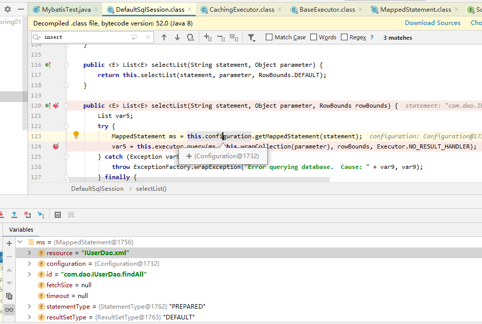
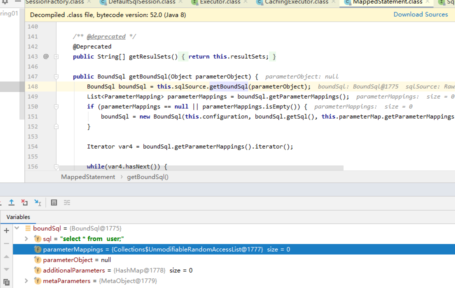
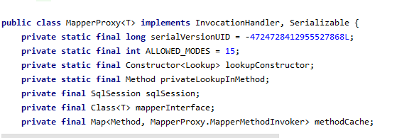
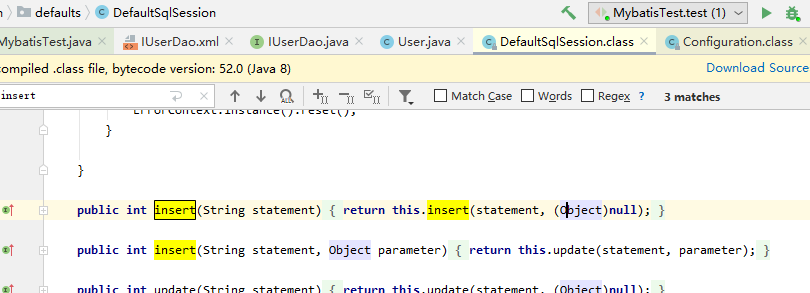
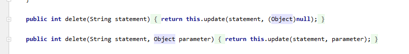
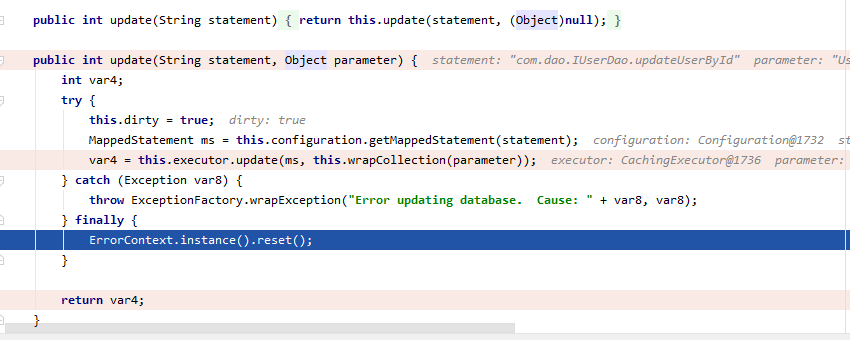

### Mybatis 分析

##### 简单示例

编写简单的示例来调试跟踪 Mybatis。

pom.xml

```xml
	<dependency>
      <groupId>org.mybatis</groupId>
      <artifactId>mybatis</artifactId>
      <version>3.5.4</version>
    </dependency>
  	<dependency>
      <groupId>mysql</groupId>
      <artifactId>mysql-connector-java</artifactId>
      <version>8.0.19</version>
 	 </dependency>

      <dependency>
      <groupId>org.slf4j</groupId>
      <artifactId>slf4j-log4j12</artifactId>
      <version>1.7.21</version>
    </dependency>
    <dependency>
      <groupId>org.projectlombok</groupId>
      <artifactId>lombok</artifactId>
      <version>1.18.8</version>
    </dependency>
    <dependency>
      <groupId>junit</groupId>
      <artifactId>junit</artifactId>
      <version>4.11</version>
      <scope>test</scope>
    </dependency>
```


sqlConfig.xml 文件

```xml
<?xml version="1.0" encoding="UTF-8"?>
<!DOCTYPE configuration
        PUBLIC "-//mybatis.org//DTD Config 3.0//EN"
        "http://mybatis.org/dtd/mybatis-3-config.dtd">
<configuration>
    <!-- 配置环境 -->
    <environments default="mysql">
        <!-- 配置mysql的环境-->
        <environment id="mysql">
            <!-- 配置事务的类型-->
            <transactionManager type="JDBC"></transactionManager>
            <!-- 配置数据源（也叫连接池） -->
            <dataSource type="POOLED">
                <!-- 配置连接数据库的4个基本信息 -->
                <property name="driver" value="com.mysql.cj.jdbc.Driver"/>
                <property name="url" value="jdbc:mysql://localhost:3306/test?serverTimezone=UTC"/>
                <property name="username" value="root"/>
                <property name="password" value="root"/>
            </dataSource>
        </environment>
    </environments>

    <!-- 指定映射配置文件的位置，映射配置文件指的是每个dao独立的配置文件 -->
    <mappers>
        <!--resource目录下 对应要创建相应的包 -->
        <mapper resource="IUserDao.xml"/>
    </mappers>
</configuration>
```

测试类 MybatisTest.java

```java
import com.entity.User;
import com.dao.IUserDao;
import org.apache.ibatis.io.Resources;
import org.apache.ibatis.session.SqlSession;
import org.apache.ibatis.session.SqlSessionFactory;
import org.apache.ibatis.session.SqlSessionFactoryBuilder;
import org.junit.Test;

import java.io.IOException;
import java.io.InputStream;
import java.util.List;

public class MybatisTest {
    @Test
    public void test() throws IOException {
        // 读取配置文件
        InputStream in = Resources.getResourceAsStream("SqlMapConfig.xml");
        // 创建 SqlSession工厂
        SqlSessionFactoryBuilder sqlSessionFactoryBuilder = new SqlSessionFactoryBuilder();
        // DefaultSqlSessionFactory
        SqlSessionFactory sqlSessionFactory = sqlSessionFactoryBuilder.build(in);
        // 使用工厂生产的 SqlSession对象 DefaultSqlSession
        SqlSession sqlSession = sqlSessionFactory.openSession();
        // 使用sqlsession 创建 Dao接口的代理对象
        IUserDao mapper = sqlSession.getMapper(IUserDao.class);
        // 使用代理对象执行方法
        List<User> users = mapper.findAll();
        for (User user : users) {
            System.out.println(user);
        }
        // 提交事务
        sqlSession.commit();
        // 释放资源
        sqlSession.close();
        in.close();

    }
}

```

##### SqlSession

Mybatis使用DefaultSqlSession实现类实现SqlSession接口。

查询所有 findAll()

```java
public <E> List<E> selectList(String statement, Object parameter, RowBounds rowBounds) {
        List var5;
        try {
            MappedStatement ms = this.configuration.getMappedStatement(statement);
            // rowBounds: offset=0 limit=2147483647 参考MySQL limit
            // 调用 CachingExecutor.<E> List<E> query(...)方法，query()又调用MappedStatement中的 BoundSql getBoundSql(Object parameterObject) 获取sql语句。
            var5 = this.executor.query(ms, this.wrapCollection(parameter), rowBounds, Executor.NO_RESULT_HANDLER);
        } catch (Exception var9) {
            throw ExceptionFactory.wrapException("Error querying database.  Cause: " + var9, var9);
        } finally {
            ErrorContext.instance().reset();
        }

        return var5;
    }
```

获取mybatis配置文件和所执行方法



获取 findAll() 的 sql 语句

mybatis 使用 jdk动态代理实现对方法的增强 



##### mybatis的 CUD 操作都是通过 update()函数来执行










